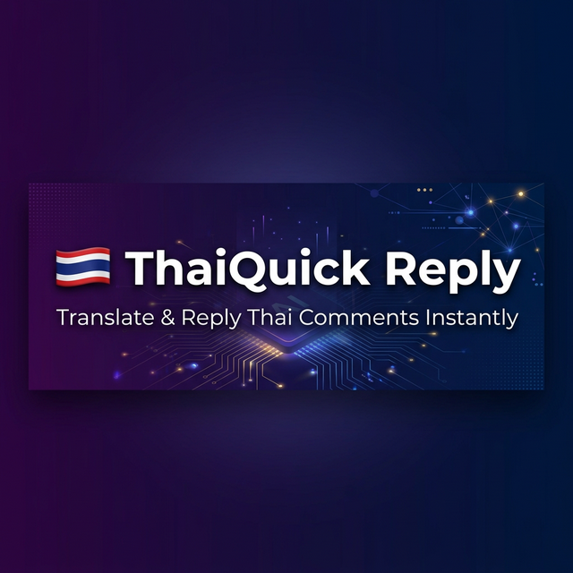

<p align="center">
  
</p>

<h1 align="center">🇹🇭 ThaiQuick Reply</h1>

<p align="center">
  <strong>Chrome Extension giúp creator Việt đọc & trả lời bình luận tiếng Thái cực nhanh</strong>
</p>

<p align="center">
  
  
  
  
</p>

---

## ✨ Tính năng chính

| Tính năng | Mô tả |
|-----------|-------|
| 🔄 **Dịch tự động** | Phát hiện & dịch bình luận Thái → Việt ngay tại trang |
| 💬 **AI Reply** | Tạo câu trả lời tiếng Thái tự nhiên bằng AI |
| 🎭 **13 prompt mẫu** | Shop Online, Idol, Gen Z, Motivator, Food Blogger... |
| 📝 **Custom Prompt** | Tự viết prompt riêng cho AI reply |
| 🔌 **4 AI Provider** | Gemini, Kimi, Cloudflare AI (Free), CLIproxyAPI (ChatGPT/Codex) |
| 🖥️ **Server Control** | Bật/tắt CLIproxyAPI server ngay trong extension |
| ⚡ **Dịch context nhanh** | Dùng MyMemory API cho dịch context cực nhanh |
| 🌐 **Auto-translate** | Tự động dịch tất cả bình luận Thái trên trang |

## 🚀 Cài đặt

### Bước 1: Clone repo

```bash
git clone https://github.com/YOUR_USERNAME/ThaiQuick-Reply-Extension.git
cd ThaiQuick-Reply-Extension
```

### Bước 2: Load extension vào Chrome

1. Mở `chrome://extensions/`
2. Bật **Developer mode** (góc phải trên)
3. Click **"Load unpacked"** → chọn thư mục `ThaiQuick-Reply-Extension`

### Bước 3: Cấu hình API

1. Click icon extension → **Tab ⚙️ API**
2. Chọn provider & nhập API key
3. Bấm **💾 Lưu cài đặt**

### Bước 4: Sử dụng CLIproxyAPI (tuỳ chọn)

Nếu muốn dùng ChatGPT/Codex miễn phí:

1. Mở popup → **Tab ⚙️ API** → chọn **CLIproxyAPI (ChatGPT)**
2. Bấm **▶️ Bật Server** → chờ 🟢
3. Management Key mặc định: `thaiquick123`
4. Bấm **🔓 Đăng nhập Codex (ChatGPT)** → đăng nhập tài khoản ChatGPT

> ⚠️ Lần đầu sử dụng cần đăng ký Native Messaging Host:
> ```bash
> reg add "HKCU\Software\Google\Chrome\NativeMessagingHosts\com.thaiquick.cliproxy_host" /ve /t REG_SZ /d "<đường dẫn tới>\CLIProxyAPI\native_host\com.thaiquick.cliproxy_host.json" /f
> ```

## 🔌 AI Providers

| Provider | Chi phí | Cách lấy key |
|----------|---------|---------------|
| **Gemini** | Miễn phí (có quota) | [Google AI Studio](https://aistudio.google.com/apikey) |
| **CLIproxyAPI** | Miễn phí (dùng tài khoản ChatGPT) | Đã tích hợp sẵn |
| **Kimi** | Miễn phí (có quota) | [Moonshot Platform](https://platform.moonshot.cn) |
| **Cloudflare AI** | Miễn phí | [Cloudflare Dashboard](https://dash.cloudflare.com) |

## 🎭 Prompt mẫu có sẵn

Chọn nhanh trong **Tab 💬 AI Reply**:

| Mẫu | Tính cách |
|-----|-----------|
| 😄 Vui vẻ | Lạc quan, năng lượng, hay dùng 555 |
| 🌸 Lịch sự | Nhã nhặn, kính ngữ, trang nhã |
| 🔥 Gen Z | Trendy, slang, vibe chill |
| 🎩 Nghiêm túc | Chuyên nghiệp, ít emoji |
| 🥰 Dễ thương | Ngọt ngào, nhiều emoji cute |
| 🛒 Shop Online | Bán hàng, mời inbox |
| 💕 Cảm ơn fan | Ấm áp, trân trọng |
| ⭐ Idol/KOL | Cool, tự tin, cá tính |
| 📱 Reviewer | Trung thực, gần gũi |
| 🍜 Food Blogger | Vui, nhiều emoji đồ ăn |
| 💪 Motivator | Truyền cảm hứng |
| 📚 Giáo viên | Kiên nhẫn, dễ hiểu |
| 😏 Tán tỉnh | Hài hước, dí dỏm |

## 📝 Custom Prompt

Biến có sẵn: `{tone}`, `{speaker}`, `{comment}`, `{hint}`

```
Bạn là admin shop mỹ phẩm Hàn Quốc.
Phong cách: {tone}, xưng hô: {speaker}.
Mời khách inbox tư vấn. Reply: {comment}
```

## 📁 Cấu trúc project

```
ThaiQuick-Reply-Extension/
├── manifest.json          # Chrome Extension manifest V3
├── config.js              # Config mặc định (rỗng, nhập key qua popup)
├── background.js          # Service worker - xử lý AI calls
├── content.js             # Content script - inject UI vào YouTube
├── content.css            # Styling cho toolbar trong trang
├── popup.html             # Popup UI (2 tabs: API & AI Reply)
├── popup.js               # Popup logic + 13 prompt presets
├── popup.css              # Popup styling (dark theme)
├── icons/                 # Extension icons
├── CLIProxyAPI/           # CLIproxyAPI server
│   ├── cli-proxy-api.exe  # Server binary (đã đi kèm)
│   ├── native_host/       # Native messaging scripts
│   └── start_server.bat   # Khởi động server thủ công
└── .gitignore
```

## 🤝 Đóng góp

1. Fork repo
2. Tạo branch: `git checkout -b feature/ten-tinh-nang`
3. Commit: `git commit -m "Add: tính năng mới"`
4. Push & tạo Pull Request

## 📄 License

MIT License — xem file [LICENSE](LICENSE).

---

<p align="center">
  Made with ❤️ for Vietnamese creators in Thailand 🇹🇭🇻🇳
</p>
