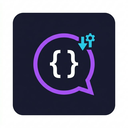

<p align="center">
  
</p>

<h1 align="center">💬 Thai Comment Manager</h1>

<p align="center">
  <strong>Chrome Extension giúp creator Việt quản lý & phản hồi bình luận nước ngoài trên YouTube Studio</strong>
</p>

<p align="center">
  
  
  
  
</p>

---

## ✨ Tính năng chính

| Tính năng | Mô tả |
|-----------|-------|
| 📤 **Export JSON** | Quét tất cả bình luận nước ngoài trên trang → xuất JSON |
| 📥 **Import Reply** | Paste JSON reply từ AI (ChatGPT/Gemini) → tự động điền vào ô phản hồi |
| 👁️ **Preview** | Xem trước tất cả reply + bản dịch trước khi áp dụng |
| 🇻🇳 **Dịch inline** | Hiện bản dịch tiếng Việt của comment & reply ngay trên trang |
| 🔢 **Giới hạn export** | Chọn số lượng bình luận xuất mỗi lần (10/15/20/25/30/Tất cả) |
| 🔍 **Smart Matching** | Ghép reply đúng comment bằng text + tên tác giả (không sợ reload) |

## 🚀 Cách hoạt động

```
📤 Export → 🤖 AI xử lý → 📥 Import → 👁️ Preview → ✅ Áp dụng → 🖱️ Nhấn Phản hồi
```

### Bước 1: Export bình luận
1. Vào YouTube Studio → **Cộng đồng** → **Bình luận**
2. Nhấn nút 💬 trên trang → mở panel
3. Nhấn **📋 Quét & Export JSON** → Copy JSON

### Bước 2: Nhờ AI trả lời
1. Paste JSON vào **ChatGPT / Gemini**
2. Nhờ AI dịch bình luận & tạo câu trả lời
3. AI trả về JSON reply theo format:

```json
{
  "replies": [
    {
      "id": 1,
      "author": "@username",
      "comment": "ต่อเลยครับ",
      "translation": "Tiếp tục đi",
      "reply": "ขอบคุณครับ จะทำต่อนะครับ 🙏",
      "replyTranslation": "Cảm ơn, sẽ làm tiếp nhé 🙏"
    }
  ]
}
```

### Bước 3: Import & Preview
1. Paste JSON reply vào ô **Import**
2. Nhấn **👁️ Xem trước** → kiểm tra từng reply
3. Nhấn **✅ Xác nhận & Áp dụng** → reply tự điền vào ô trên trang
4. Kiểm tra bản dịch hiện trên trang → nhấn **Phản hồi** từng cái

## ⚙️ Cài đặt

### Cài extension
1. Mở `chrome://extensions/` → bật **Developer mode**
2. Click **"Load unpacked"** → chọn thư mục project
3. Vào YouTube Studio để sử dụng

### Tuỳ chỉnh (Popup)
- **Số bình luận export**: 10 / 15 / 20 / 25 / 30 / Tất cả

## 📁 Cấu trúc project

```
Thai-Comment-Manager/
├── manifest.json       # Chrome Extension manifest V3
├── background.js       # Service worker
├── content.js          # Content script — inject UI vào YouTube Studio
├── content.css         # Styling cho panel & badges
├── popup.html          # Popup UI — cài đặt
├── popup.js            # Popup logic
├── popup.css           # Popup styling (dark theme)
├── icons/              # Extension icons (16/48/128)
└── config.js           # Config mặc định
```

## 📝 JSON Format

### Export (bình luận)
```json
{
  "totalFound": 20,
  "totalComments": 15,
  "comments": [
    {
      "id": 1,
      "author": "@username",
      "comment": "ต่อเลยครับ",
      "translation": "",
      "videoTitle": "Video Title",
      "hasReplyBtn": true
    }
  ]
}
```

### Import (reply từ AI)
```json
{
  "replies": [
    {
      "id": 1,
      "author": "@username",
      "comment": "ต่อเลยครับ",
      "translation": "Tiếp tục đi",
      "reply": "ขอบคุณครับ 🙏",
      "replyTranslation": "Cảm ơn nhé 🙏"
    }
  ]
}
```

> **Quan trọng:** Bảo AI giữ nguyên field `author` và `comment` từ export JSON để matching chính xác.

## 📄 License

MIT License — xem file [LICENSE](LICENSE).

---

<p align="center">
  Made with ❤️ by @quocloi03
</p>
